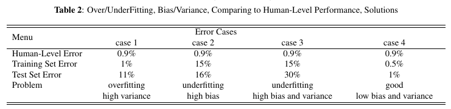

1. **Complete the sentence:** In a decision tree, high information gain indicates adding a split to the decision tree results in a 【less/more】 accurate model. [more]

2. **Complete the sentence:** Performing splitting based on highly informative event usually leads to [high/low] model generalization and a [less/more] accurate one as well. [low, less]

3. **Complete the sentence:** From the paper of Neural Network Ensembles, if the average error rate for a specific instance in the corpus is less than [??]% and the respective classifiers in the ensemble produce independent [??], then when the number of classifiers combined approaches infinity, the expected error can be diminished to zero. [50%, results/errors]

4. **关于bagging,boost选样本放回(replacement)与不放回(non replacement)的问题:** 假设单次训练都需要**随机**选取n个样本，不同的地方在于如何得到这n个随机样本即如何随机，(1)bootstrap aggregation (or bagging)是每次有放回的随机选1个样本，然后选n次; (2)boosting是一次性随机选取n个样本，也即无放回的一次一次随机取。

5. **Bagging** is **variance** reduction scheme while **boosting** reduces **bias**.

6. **variance-bias trade off**[TBD]

---

### ref 1: https://easyai.tech/ai-definition/random-forest/
### ref 2: https://easyai.tech/ai-definition/decision-tree/
### ref 3: https://towardsdatascience.com/ensemble-methods-bagging-boosting-and-stacking-c9214a10a205

---
